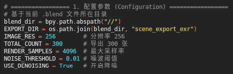
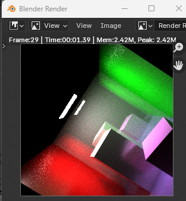
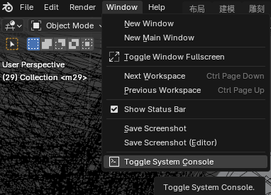
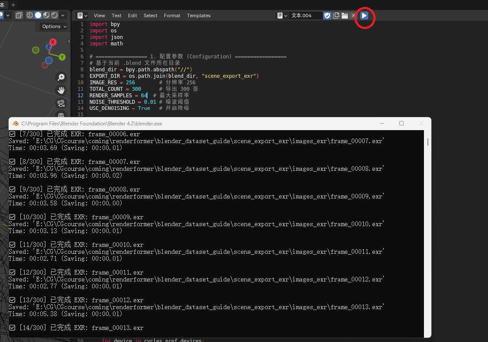

# RenderFormer Blender 数据集制备说明

> 文档目标：说明如何从 Blender 场景导出中间数据，并转换为 `FrameworkRenderformer` 可训练的 PT 数据集。  
> 重要说明：`blender_dataset_guide/cobclass.blend` 内已包含用于数据集导出的 Blender 脚本（可直接在 Blender 的 Scripting 面板运行）。

---

## 1. 适用目录约定

建议按 `USTC_CG_26/FrameworkRenderformer` 的使用方式组织：

```text
FrameworkRenderformer/
├── train_course_baseline.py             # 训练入口
├── build_pt_dataset_from_blender.py     # Blender 中间数据转 PT
├── baseline_data.py
├── baseline_model.py
├── local_renderformer/
├── runs/                                # 训练输出（自动生成）
└── datasets/                            # 推荐放置 PT 数据集（可自定义）
```

说明：
- Blender 导出目录（如 `scene_export_xxx/`）是“转换输入”，不是可直接训练的 PT 数据集。
- 可放在 `FrameworkRenderformer` 同级或子目录，只要在命令中正确传参即可。

---

## 2. 全流程总览

```text
Blender 场景（含导出脚本）
   │
   ├─ 导出几何与材质（objs + materials.json）
   ├─ 多视角渲染图像（images_exr/*.exr 或 png）
   └─ 导出相机参数（camera.json）
        ↓
build_pt_dataset_from_blender.py
        ↓
PT 数据集（train/*.pt）
        ↓
train_course_baseline.py
        ↓
可视化结果 + checkpoint
```

---

## 3. Blender 导出前检查（建议先做）

在正式运行长时间批量渲染前，先进行参数降级与单帧测试，可明显降低排错成本。

### 3.1 调低参数做预览

优先调小：
- 图像分辨率
- 导出视角数量
- 渲染采样率
- 噪声阈值


> 助教提示：降低采样率并适当提高噪声阈值，可显著加快预览速度。

### 3.2 使用 F12 单帧预渲染

操作步骤：
1. 按下快捷键 **F12**（部分笔记本需 `Fn + F12`）。
2. 观察当前相机渲染结果，确认材质、灯光、构图是否正常。


> 预渲染可快速发现穿模、材质异常、光照过暗等问题。

### 3.3 打开系统控制台查看进度（Windows）

操作步骤：
1. 菜单栏点击 **窗口 (Window)**。
2. 选择 **切换系统控制台 (Toggle System Console)**。
3. 在黑色控制台中观察脚本 `print()` 输出。



当你点击运行脚本（单击脚本编辑器中的运行箭头）后，控制台会实时打印类似 `[1/300] 已完成 EXR: frame_00000.exr` 的进度信息，可用于判断脚本是否正常推进。



> **⚠️ 危险警告：** 不要直接点击控制台窗口右上角 `X`。  
> 这会强制关闭 Blender，可能导致未保存内容丢失。  
> 若仅需隐藏控制台，请再次点击 **窗口 -> 切换系统控制台**。

---

## 4. Blender 导出结果规范

目标结构建议如下：

```text
<scene_export_dir>/
├── objs/
│   ├── xxx.obj
│   └── xxx.mtl
├── images_exr/
│   ├── frame_00000.exr
│   ├── frame_00001.exr
│   └── ...
├── camera.json
└── materials.json
```

### `camera.json` 最小示例

```json
{
  "camera_angle_x": 0.9452,
  "frames": [
    {
      "file_path": "images_exr/frame_00000.exr",
      "transform_matrix": [[...4x4...]],
      "fl_x": 250.35
    }
  ]
}
```

---

## 5. 将中间数据转换为 PT

以下命令在 `FrameworkRenderformer` 目录执行：

```powershell
python build_pt_dataset_from_blender.py `
  --obj_dir "<scene_export_dir>/objs" `
  --camera_json "<scene_export_dir>/camera.json" `
  --image_root "<scene_export_dir>" `
  --out_dir "<pt_dataset_dir>" `
  --split train `
  --scene_name "<scene_name>" `
  --image_size 128 `
  --texture_patch_size 1
```

占位符说明：
- `<scene_export_dir>`：Blender 导出目录
- `<pt_dataset_dir>`：转换后的 PT 数据目录
- `<scene_name>`：自定义场景标识

---

## 6. 转换后自检

转换成功后应看到：

```text
<pt_dataset_dir>/
└── train/
    ├── 00000.pt
    ├── 00001.pt
    ├── ...
    └── dataset_summary.json
```

最小检查项：`.pt` 文件数量与导出视角数一致


